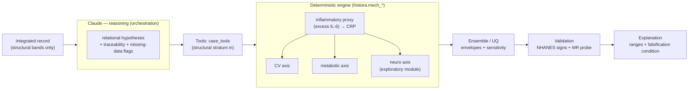

# HISTORA — Oral-Systemic Intelligence Agent

> A **non-diagnostic** research agent that relates periodontal (gum) disease to systemic disease —
> **cardiovascular, metabolic, and Alzheimer's / neurodegeneration** — by (1) surfacing oral-systemic
> risk **hypotheses** from a patient's data with Claude, and (2) building and running **mechanistic
> mathematical models** of the candidate pathways, **calibrated to real interventional data and
> validated against public population data**. It turns *"these things co-occur"* into *"here is a
> candidate mechanism, simulated, calibrated, checked against real data, with honest uncertainty."* It
> never diagnoses and never imputes a patient value.

## Introduction — the problem and the solution

**The problem.** Periodontitis is a common, chronic, low-grade inflammatory disease. A growing body of
evidence links it to **cardiovascular disease**, **dysglycaemia / type-2 diabetes**, and — more
recently — **Alzheimer's disease and related dementias**, plausibly through **systemic inflammation**.
But that evidence is fragmented in two ways. First, it is **split between population statistics on one
side and disconnected molecular mechanisms on the other** — epidemiology says *whether*, mechanism says
*why*, and the two rarely meet. Second, the three disease axes are studied **separately**: perio→CV,
perio→diabetes, and perio→AD each have their own literature, their own models, and their own
parameters, even though they plausibly share **one upstream driver**. No single public dataset even
co-measures the inflammatory mediator that is supposed to connect them, and the one direct causal drug
test of the neuro hypothesis (atuzaginstat / GAIN) **failed** — so the honest terrain is
*plausible-but-unproven*.

**The solution.** HISTORA couples the three axes through **one shared quantity — the effective
inflammatory gain** (excess IL-6 over baseline). A structural periodontal source drives IL-6 → hepatic
CRP, and that one gain then forks into the cardiovascular, metabolic, and neuro axes. The single
honestly-uncertain edge is **calibrated to real interventional data** (the CRP and HbA1c reductions
measured after periodontal therapy), uncertain couplings are **swept as ranges**, a language model
contributes **weight-capped, falsifiable** estimates only where the equations run out, and a
**non-diagnostic guardrail** is enforced by construction. The result is one internally-consistent,
falsifiable object instead of three disconnected associations — and, on a pre-specified benchmark, it
is measurably more parsimonious, coherent, calibrated, and uncertainty-honest than either applying the
models separately or using Claude without the harness (see below).

> **Positioning:** HISTORA is a **scientific research agent**, not a disease predictor or a diagnostic
> aid. It helps a researcher form and prioritize **falsifiable** oral–systemic hypotheses with explicit
> mechanism and honest uncertainty. Its shared driver is a **latent inflammatory proxy** (operationalized
> as excess IL-6), not a claim that IL-6 is the sole mechanism.

> **Calibration ≠ validation** (read this before quoting numbers). Two different things:
> **calibration** pins the one uncertain edge (ε, and k for HbA1c) to real *interventional* anchors — an
> input constraint, not a result. **Validation** is independent: the three association directions the
> engine predicts appear, confounder-adjusted, in public NHANES; and a genetic **Mendelian-randomization**
> probe supports the causal chain where we anchor it (CV) and withholds it where we flag it exploratory
> (neuro). Never read the calibration as if it were the validation.

> **New here?** Read [`docs/PAPER.md`](docs/PAPER.md) (the full technical report),
> [`docs/PROBLEM.md`](docs/PROBLEM.md) (the problem, for clinicians + engineers),
> [`docs/SOLUTION.md`](docs/SOLUTION.md) (how it works), [`docs/BENCHMARK.md`](docs/BENCHMARK.md)
> (how we validate that it beats the alternatives), and the Stage-2 plan
> [`docs/STAGE2-WORKPLAN.md`](docs/STAGE2-WORKPLAN.md).

## Architecture — who does what (Claude vs. the engine)



| **Claude decides** | **The engine decides** |
|---|---|
| *what* to run (which models fit the case) | the **numbers**: calibrate ε, propagate the proxy |
| *how* to report uncertainty (routes to ranges) | the **envelopes** (Latin-hypercube sweep + sensitivity) |
| *when* to route to falsification (the refutation) | the deterministic ODE/PDE/MR computations |
| soft estimates **only** for un-coded edges — **weight-capped**, never a headline number | the calibrated/validated spine that always outweighs a Claude soft member |

## The hackathon

Co-organized with **Gladstone Institutes**, a leader in neurodegeneration research (tau, APOE4,
microglia/neuroinflammation, the blood-brain barrier). HISTORA's **oral → neuro axis** — periodontitis
→ systemic inflammation → neuroinflammation → tau propagation — offers Gladstone-adjacent labs a
**novel upstream perturbation** to plug into their existing tau/microglia/BBB frameworks.

## The pipeline

One shared quantity — the **effective inflammatory gain** (excess IL-6) — links a periodontal
inflammatory source to three systemic axes:

```
 periodontal severity ─► IL-6 ─► hepatic CRP        (ε calibrated to the real ~0.5 mg/L
 (structural, non-diagnostic)     turnover, t½≈19h    ΔhsCRP-after-periodontal-therapy anchor)
                                        │
                     ┌──────────────────┼───────────────────────┐
              METABOLIC             CARDIOVASCULAR             NEURO
        (insulin resistance →   (endothelium / atherosclerosis, (neuroinflammation → tau-spread α →
         HbA1c; k calibrated to  IL-6→CRP recruitment index)     Fisher–KPP propagation on the connectome)
         the ~0.35 pp anchor)
```

1. **Claude-powered relational agent** — given an integrated record, Claude produces structured,
   non-diagnostic oral↔CV↔metabolic↔neuro hypotheses (relational axes + mechanisms + full traceability
   + missing-data flags). `src/histora/agent.py`, `src/run_agent.py`.
2. **Mechanistic-modeling harness** — pure-python tools that *formulate and run* mechanistic models
   (ODEs, control theory, reaction-diffusion), grounded in a **curated, cited model library**
   ([`docs/MODELS.md`](docs/MODELS.md), [`docs/model-library.md`](docs/model-library.md)). The
   centerpiece chain is **calibrated to real interventional anchors** and forks to the CV, metabolic,
   and neuro axes; every uncertain coupling is **flagged and swept as a range**. `src/histora/mech_*.py`.
3. **Ensemble / uncertainty quantification** — a Latin-hypercube sweep of the flagged parameters →
   **envelopes** (median + 90% band) + a sensitivity ranking, so predictions are ranges, not points.
   A language model can join as a **weight-capped, tier-labelled soft member** for un-coded edges.
   `src/histora/ensemble.py`, `registry.py`, `claude_model.py`.
4. **Empirical validation on public data** — the three predicted directions are all present in real
   **NHANES**, confounder-adjusted, bootstrap-CI'd: perio→**CRP**↑ (2009-2010, n=8 686), perio→**HbA1c**↑
   (2009-2010, n=8 744), perio→**cognition**↓ (2011-2012, 3/4 measures, n≈919).
   `src/histora/perio_cognition.py`, `src/run_perio_{cv,diabetes,cognition}.py`.
5. **Comparative validation** — a pre-specified benchmark showing the integrated harness beats (S)
   separate single-axis models and (C) Claude without the harness on parsimony, coherence, calibration,
   uncertainty, and falsifiability (direction ties). `src/histora/benchmark.py`, `src/run_benchmark.py`.
6. **An honest apparatus** — scoring, counterfactual-sensitivity, the execution-gap capability (W1), and
   bootstrap confidence intervals (a claim never fires on a sub-noise delta). `src/histora/ab_eval.py`,
   `counterfactual.py`, `exec_gap.py`, `stats.py`.

Everything is a **validated capability, a validated association, or an explicitly-flagged-and-swept
hypothesis** — nothing that could not be verified or reproduced was kept.

## Headline results

| Claim | Evidence |
|---|---|
| The three predicted directions are real | NHANES: perio→CRP +0.041, perio→HbA1c +0.12 to +0.16, perio→cognition −0.06 to −0.18 (3/4) — all confounder-adjusted, CI excludes 0 |
| One calibrated parameter, three axes | ε (and k_hba1c) calibrated to the interventional ΔCRP / ΔHbA1c anchors; the axes follow |
| Beats separate models | benchmark: 1 vs 3 free params, calibration error 0.00 vs 0.71, intervals + falsifiability 1.00 vs 0.00; direction ties |
| Beats bare Claude | benchmark: calibration error 0.00 vs 1.25, intervals + falsifiability 1.00 vs 0.00; the harness's guardrail edge is the subtle execution-gap step (W1: 0.00→1.00) |
| Genetic causal probe (Mendelian randomization) | IL-6R → coronary disease **causal** (IVW β=+0.105, p<0.001); CRP/IL-6 → Alzheimer's **null** (p=0.91) — genetics that supports the CV/metabolic-anchored vs. neuro-exploratory tiering (`run_mendelian_randomization.py`) |
| Survives design-adjusted stats | With NHANES survey weights + clustering + BH-FDR, CRP/CV/HbA1c and processing-speed **all survive**; two weaker cognition measures attenuate and drop — reported honestly (`run_nhanes_weighted.py`) |

## Run it

The mechanistic + benchmark + validation code is **pure Python** (no GPU); the association runners need
`pandas` + network for NHANES, and the Claude agent / live benchmark arm needs `anthropic` +
`ANTHROPIC_API_KEY` (a local `.env`).

```bash
python src/run_mechanistic.py         # periodontal source → IL-6/CRP → CV/metabolic/neuro axes (offline)
python src/run_mech_neuro.py          # the neuro axis: neuroinflammation → tau spread (offline)
python src/run_ensemble.py            # the ensemble envelopes over the swept parameters (offline)
python src/run_benchmark.py           # S vs H comparative validation (offline); add --live for bare Claude
python src/run_mendelian_randomization.py   # genetic causal probe of the shared proxy (offline)
python src/run_nhanes_weighted.py     # design-adjusted NHANES (survey weights + FDR); needs pandas+data
python src/run_agent_metrics.py       # agentic-AI metric card: citation/hallucination/coverage (offline)
python src/run_perio_cognition.py     # empirical validation, NHANES 2011-2012 (needs pandas + network)
python src/run_perio_diabetes.py      # metabolic anchor, NHANES 2009-2010 (needs pandas + network)
python src/run_agent.py               # the Claude-powered non-diagnostic relational agent (needs API key)
for t in tests/test_*.py; do python3 "$t"; done   # the pure-python harness tests
```

## Layout

```
dental-analysis/
  src/histora/                # the package, aligned to the solution
    record_formats · bridge_concepts · relational_signals   # domain: records, mediators, signals
    agent · claude_model                                    # Claude: relational analysis + soft member
    mech_ode · mech_models · mech_calibrate                 # the mechanistic spine + calibration
    mech_neuro · mech_metabolic                             # the neuro and metabolic axes
    ensemble · registry                                     # ensemble / UQ + the model registry
    benchmark                                               # the comparative validation (S vs C vs H)
    ab_eval · counterfactual · stats · exec_gap             # the honest apparatus + execution gap
    perio_cognition · nhanes                                # the empirical validation + data
  src/run_*.py                # entrypoints (mechanistic, neuro, ensemble, benchmark, perio-*, agent)
  schemas/                    # the non-diagnostic output contract
  agents/ skills/             # the Claude Code agent + skill catalog (see their README.md)
  plugin/                     # the case-evaluation Claude Code plugin (packages the above)
  docs/                       # PAPER, PROBLEM, SOLUTION, BENCHMARK, MODELS, model-library, DATASETS, ROADMAP
  tests/                      # pure-python harness tests (no GPU)
```

## Data & guardrails

Grounded in **public, de-identified NHANES** (2009-2010 for the periodontal + cardiovascular + metabolic
+ inflammatory anchors; 2011-2012 for the periodontal + cognitive battery), plus a curated mechanistic
model library from the peer-reviewed literature. **Non-diagnostic throughout:** research hypotheses and
mechanistic models only; missing data is a collection flag, never an imputed value; every relational
axis cites the input fields it was derived from. Hypothesis-level couplings are flagged and reported as
ranges, and the one failed causal drug test of the periodontitis→Alzheimer hypothesis (atuzaginstat /
GAIN) is named as the standing caveat. See [`docs/DATASETS.md`](docs/DATASETS.md).
