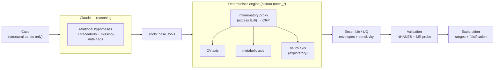

# HISTORA — Oral-Systemic Intelligence Agent

> A **non-diagnostic scientific research agent** (not a disease predictor) that links periodontal disease
> to **cardiovascular, metabolic, and Alzheimer's** disease through **one shared inflammatory proxy**,
> and turns fragmented data into **falsifiable, uncertainty-quantified, mechanistically-explained
> hypotheses** — validated on public data and genetics. It never diagnoses and never imputes a patient value.

*Built with Claude: Life Sciences · co-organized with **Gladstone Institutes**.*
**→ The hackathon pitch and winning objective: [`docs/PITCH.md`](docs/PITCH.md).**

## What we demonstrate to win

The first **safe, transparent, mechanistic** oral-systemic research agent: Claude orchestrates a
calibrated mechanistic engine to produce hypotheses that are **coherent** (one lever → three diseases),
**calibrated** (to real treatment data), **honest** (ranges + falsification + citations), and **validated**
(public data + genetics) — provably better than separate single-disease models or bare Claude, with a
hard non-diagnostic guardrail. All in one 3-minute demo:

```bash
python demo/run_demo.py        # the canonical end-to-end brief (offline; --live for the real Claude agent)
```

## Architecture — who does what (Claude vs. the engine)


*(Static PNG for slides / when Mermaid doesn't render: [`docs/assets/architecture.png`](docs/assets/architecture.png).)*


**Claude** decides *what* to run, *how* to report uncertainty, and *when* to route to falsification — and
supplies weight-capped soft estimates only for un-coded edges. **The engine** decides the numbers
(calibrate ε, propagate the proxy, sweep the ranges). Claude never sources a headline number.

## Headline results (all reproducible)

| Claim | Evidence |
|---|---|
| The 3 predicted directions are real | NHANES: perio→CRP +0.041, →HbA1c +0.12–0.16, →cognition −0.06 to −0.18 — confounder-adjusted |
| …and survive rigorous stats | design-adjusted (survey weights + clustering) + BH-FDR: CRP/CV/HbA1c + processing-speed **survive** |
| One calibrated parameter, three axes | ε (and k) calibrated to the interventional ΔCRP/ΔHbA1c anchors; the axes follow |
| Genetic causal probe | Mendelian randomization: IL-6R→coronary disease **causal**, CRP→Alzheimer's **null** |
| Beats separate models & bare Claude | benchmark: 1 vs 3 params, calibration error 0.00 vs 0.71/1.25, ranges+falsifiability 1.00 vs 0.00 |
| Safe agent, measured | agentic card: citation accuracy 1.0, hallucination 0.0, coverage 1.0, guardrail enforced |
| Self-improving — safely | SkillOpt: Claude edits its own skill; kept only if it measurably improves (CI excludes 0) **and** the non-diagnostic guardrail stays 1.0 — an invariant that is structurally impossible to evolve. The archive shows an *adopted* edit beside a *rejected* one that gained the same metric but broke the guardrail. |

> **Calibration ≠ validation.** *Calibration* pins the one uncertain edge (ε, k) to real *interventional*
> anchors — an input constraint. *Validation* is independent: the NHANES association signs and the genetic
> MR probe. We never present the former as the latter.

## How we deliver it

**Two surfaces, one engine.** Today, a **Claude Code plugin** (`plugin/histora-oral-systemic`) — the
portable demo a judge runs anywhere. Its home is **Claude Science**, whose native extension model is
**skills + connectors** (not "plugins"): HISTORA's `skills/` become skills, the `histora` harness a
reusable pipeline, `agents/` the specialist agents, and UniProt/PDB/GWAS/NHANES the connectors — the same
components, ported directly. Quickstart + proven live results: [`docs/CLAUDE-SCIENCE.md`](docs/CLAUDE-SCIENCE.md);
full rationale + the integration table: [`docs/PITCH.md`](docs/PITCH.md).

## Run it

Pure Python (no GPU). The NHANES runners need `pandas` + network; the live Claude paths need `anthropic` +
`ANTHROPIC_API_KEY` (a local `.env`).

```bash
python demo/run_demo.py                 # the canonical end-to-end brief (offline)
python src/run_benchmark.py             # S vs H comparative validation (offline); --live adds bare Claude
python src/run_agent_metrics.py         # the agentic-AI metric card (offline)
python src/run_mendelian_randomization.py   # the genetic causal probe (offline)
python src/run_skill_evolution.py           # SkillOpt: one gated, guardrail-safe skill-evolution generation
python src/run_skill_evolution_live.py --skill traceability-audit --gens 5   # SkillOpt LIVE: Claude evolves a real skill (needs anthropic+key)
python src/run_nhanes_weighted.py       # design-adjusted NHANES (survey weights + FDR); needs pandas+data
for t in tests/test_*.py; do python3 "$t"; done   # the pure-python harness tests
```

## Documentation

- **Start here:** [`PITCH.md`](docs/PITCH.md) (how we present & win) · [`DEMO-SCRIPT.md`](docs/DEMO-SCRIPT.md) (the stage runbook) · [`CLAUDE-SCIENCE.md`](docs/CLAUDE-SCIENCE.md) (run it in Claude Science + proven results) · [`EVOLUTION.md`](docs/EVOLUTION.md) (SkillOpt — self-improving, safely)
- **Evidence:** [`PAPER.md`](docs/PAPER.md) (technical report) · [`BENCHMARK.md`](docs/BENCHMARK.md) (comparative validation) · [`CITATIONS.md`](docs/CITATIONS.md) (claim → source registry)
- **Reference:** [`MODELS.md`](docs/MODELS.md) (the models + evidence) · [`model-library.md`](docs/model-library.md) · [`PROBLEM.md`](docs/PROBLEM.md) · [`SOLUTION.md`](docs/SOLUTION.md) · [`DATASETS.md`](docs/DATASETS.md)
- **Internal** (planning & analysis): [`docs/internal/`](docs/internal/) — roadmaps, the Stage-2 work plan, the data/delivery and Claude-Science analyses, the external review, the grant draft.

## Layout

```
dental-analysis/
  demo/                       # the canonical end-to-end demo (run_demo.py + a frozen case)
  src/histora/                # the engine: mech_* (spine + neuro + metabolic), ensemble, benchmark,
                              #   mendelian_randomization, nhanes(+survey), agent_metrics, citations,
                              #   agent + claude_model (Claude: relational analysis + soft member)
  src/run_*.py                # entrypoints (demo backend, benchmark, MR, weighted NHANES, agent, …)
  agents/ skills/             # the Claude Code agent + skill catalog
  plugin/                     # the case-evaluation Claude Code plugin (→ Claude Science skills/connectors)
  docs/                       # PITCH · DEMO-SCRIPT · CLAUDE-SCIENCE · PAPER · BENCHMARK · MODELS · …
    internal/                 #   planning & analysis (roadmaps, work plan, reviews, grant)
  tests/                      # pure-python harness tests (no GPU)
```

## Data & guardrails

Grounded in **public, de-identified NHANES** (2009-2010 CV/metabolic/inflammatory anchors; 2011-2012
cognition) + public GWAS summary statistics (for MR) + a cited mechanistic model library.
**Non-diagnostic throughout:** research hypotheses and parameter-level ranges only; missing data is a
collection flag, never imputed; genetics is used at the population/instrument level. The one failed causal
drug test of the perio→Alzheimer hypothesis (atuzaginstat/GAIN) is the standing caveat.
See [`docs/DATASETS.md`](docs/DATASETS.md).
