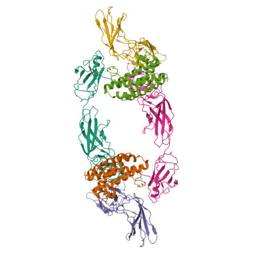
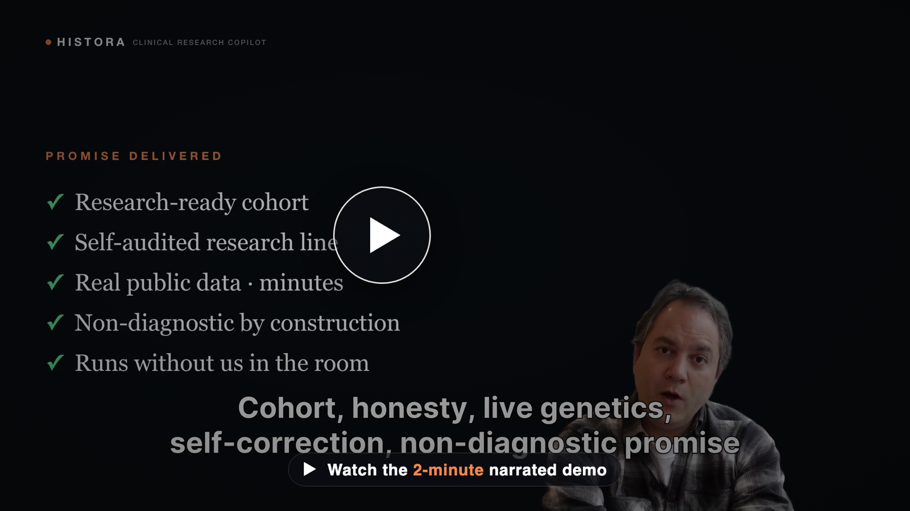
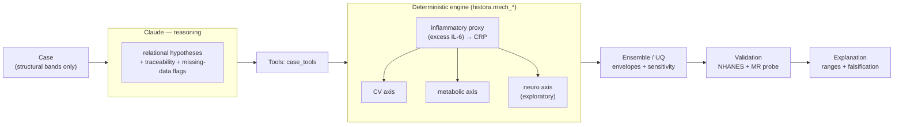

# HISTORA — Clinical Research Copilot

**License:** [Apache-2.0](LICENSE) · A **non-diagnostic** research instrument (population-level, hypothesis-generating; not medical advice).

<p align="center">
  
  <br>
  <sub><b>The causal node.</b> The IL-6 / IL-6Rα / gp130 hexameric signaling complex (PDB <code>1P9M</code>) — where the
  IL-6R genetic instrument acts and tocilizumab blocks. HISTORA's UniProt/PDB connector renders this live in
  Claude Science. <i>Image: RCSB PDB (rcsb.org).</i></sub>
</p>

> A **clinical-research copilot** that turns fragmented clinical data into a **research-ready cohort** — and
> tells you honestly **what the data cannot answer**. From a real public corpus (NHANES) it builds an
> eligibility funnel, flags every missing datum as a *collection gap it never imputes*, generates a
> **falsifiable, uncertainty-quantified hypothesis** (never a conclusion), and exports a preliminary
> protocol. Everything it emits is **population/parameter-level, traceable, and non-diagnostic** — a
> **research-integrity gate** (sharpest clause: non-diagnostic) enforced by construction, which is what
> makes the output citable.
>
> Its first instantiated payload is the **oral–systemic** question of global interest: is what we can
> measure in the mouth — periodontal inflammation — *just a marker*, or a **modifiable, treatable,
> preventable contributing factor** to the shared inflammatory biology behind **heart disease and
> diabetes**? HISTORA grounds that in genetics it runs live — the **IL-6R signaling node is genetically
> causal for coronary disease** (circulating CRP is not) — and in a cheap, non-pharmacological lever:
> periodontal therapy measurably lowers the shared inflammatory and metabolic markers (hs-CRP and HbA1c).
> The **Alzheimer's
> axis stays strictly exploratory** (the genetics are null and the direct causal trial failed). HISTORA
> never claims that treating the mouth prevents disease — it prepares the study that could test it.

*Built with Claude: Life Sciences · co-organized with **Gladstone Institutes**.*
**→ The hackathon pitch and winning objective: [`docs/PITCH.md`](docs/PITCH.md).**
**→ How it was built — the _supervised autonomous loop_ (Claude Code operating Claude Science through the
Claude for Chrome extension, as the scientist; evolution + correction):
[`docs/HOW-IT-WAS-BUILT.md`](docs/HOW-IT-WAS-BUILT.md) · the self-audit that caught a bug in its own
flagship number: [`docs/SELF-CORRECTION.md`](docs/SELF-CORRECTION.md).**

## ▶ 3-minute demo

[](https://github.com/matiasmolinas/dental-analysis/blob/main/docs/assets/HISTORA-demo.mp4)

The builder-track submission video (narrated + captioned, 1080p, ~2 min): the problem and the promise → how
it was built (Claude Code, in a supervised autonomous loop, operating Claude Science) → the copilot building
a real cohort → biology grounded live in Claude Science → the agent catching and fixing a bug in its own
flagship number → the promise delivered. **▶ [Watch / download the demo](docs/assets/HISTORA-demo.mp4)**
(MP4). Shot list, written summary, and the muted/voice-over + HeyGen kit: [`docs/SUBMISSION.md`](docs/SUBMISSION.md).

## What we demonstrate to win

A **clinical-research copilot** that assembles a real cohort from fragmented data, **states what the data
cannot answer**, and grounds one falsifiable hypothesis in genetics it runs live — then, operating its own
pipeline under a **reviewer agent**, it **caught and fixed an error in its own flagship number** (a real
LD-matrix bug; see [`docs/SELF-CORRECTION.md`](docs/SELF-CORRECTION.md)). The output is **coherent** (one
calibrated lever, multiple axes), **calibrated** (to real treatment data), **honest** (ranges +
falsification + citations + a hard non-diagnostic guardrail), and **validated** (public data + genetics
replicated across ancestries) — honest *by construction*. All in one 3-minute demo:

```bash
python demo/run_demo.py        # the canonical end-to-end brief (offline; --live for the real Claude agent)
```

## Architecture — who does what (Claude vs. the engine)


*(Static PNG for slides / when Mermaid doesn't render: [`docs/assets/architecture.png`](docs/assets/architecture.png).)*


**Claude** decides *what* to run, *how* to report uncertainty, and *when* to route to falsification — and
supplies weight-capped soft estimates only for un-coded edges. **The engine** decides the numbers
(calibrate ε, propagate the proxy, sweep the ranges). Claude never sources a headline number.

## Headline results (all reproducible)

| Claim | Evidence |
|---|---|
| A research-ready cohort from a real corpus — with honest limits | `demo/run_cohort.py` over **real NHANES 2009–2010**: an eligibility funnel **20,905 → 9,181 → 1,396 → 448 → 442**, per-field completeness, and — the differentiator — the longitudinal question it **honestly refuses** (no repeat CRP / follow-up in a cross-sectional corpus; a *collection flag*, never imputed), plus an exported preliminary protocol |
| The 3 predicted directions are real | NHANES perio→CRP, →HbA1c, →cognition — all in the predicted direction. Raw confounder-adjusted β +0.041 / +0.12–0.16 / −0.06 to −0.18; **design-adjusted** (survey-weighted, the demo's panel) +0.031 / +0.104 / −0.19 |
| …and survive rigorous stats | design-adjusted (survey weights + clustering) + BH-FDR: CRP/CV/HbA1c + processing-speed **survive** |
| Genetic causal probe — replicated across ancestries | Mendelian randomization over live public GWAS: **IL-6R→coronary disease causal** (LD-aware correlated-IVW β≈+0.553, SE 0.109), **replicated independently** in FinnGen (European) and BioBank Japan (East Asian); **circulating CRP→coronary null** and **CRP→Alzheimer's null** — the marker isn't causal, the *node* is |
| The agent audited its own work | Operating its own pipeline under a reviewer agent, HISTORA **caught, retracted, and fixed an error in its own flagship MR number** — a real LD row-ordering bug that had produced an over-confident +0.705/SE 0.010; corrected to +0.553/SE 0.109 (now agreeing with FinnGen), with a **regression test**. [`docs/SELF-CORRECTION.md`](docs/SELF-CORRECTION.md) |
| One calibrated parameter, multiple axes | ε (and k) calibrated to the interventional ΔCRP/ΔHbA1c anchors; the axes follow |
| Safe agent, measured | agentic card: citation accuracy 1.0, hallucination 0.0, coverage 1.0, guardrail enforced |
| Self-improving — safely | SkillOpt (live): Claude improved **2 of its own skills** (by different mechanisms) and correctly left a **3rd untouched** because it was already optimal — no gain manufactured where none exists. Every edit is kept only if it measurably improves (CI excludes 0) **and** the guardrail stays 1.0; the guardrail sits **outside the evolvable genome** (hash-identical parent↔child proves the invariant never moved). |
| A capability the alternatives structurally lack | *(supporting, not a horse race)* benchmark vs separate models & bare Claude: 1 shared parameter instead of 3, plus calibrated ranges + falsification they **structurally cannot** produce — a capability gap, not a higher score on a shared metric |

> **Calibration ≠ validation.** *Calibration* pins the one uncertain edge (ε, k) to real *interventional*
> anchors — an input constraint. *Validation* is independent: the NHANES association signs and the genetic
> MR probe. We never present the former as the latter.

## How we deliver it

**Two surfaces, one engine.** Today, a **Claude Code plugin** (`plugin/histora-oral-systemic`) — the
portable demo a judge runs anywhere. Its home is **Claude Science**, whose native extension model is
**skills + connectors** (not "plugins"): HISTORA's `skills/` become skills, the `histora` harness a
reusable pipeline, `agents/` the specialist agents, and UniProt/PDB/GWAS/NHANES the connectors — the same
components, ported directly. Quickstart + proven live results: [`docs/CLAUDE-SCIENCE.md`](docs/CLAUDE-SCIENCE.md);
full rationale + the integration table: [`docs/PITCH.md`](docs/PITCH.md).

## Run it

Pure Python (no GPU). The NHANES runners need `pandas` + network; the live Claude paths need `anthropic` +
`ANTHROPIC_API_KEY` (a local `.env`).

```bash
python demo/run_demo.py                 # the canonical end-to-end brief (offline)
python demo/run_case_study.py           # the flagship research case — one falsifiable research line (offline)
python demo/run_cohort.py               # the clinical-research copilot — a REAL cohort funnel over NHANES + protocol export (needs pandas+data)
python src/run_benchmark.py             # S vs H comparative validation (offline); --live adds bare Claude
python src/run_agent_metrics.py         # the agentic-AI metric card (offline)
python src/run_physiology.py                 # Stage-3: all deepened mechanisms + "one lever, many axes" (--plot for figures)
python src/run_mendelian_randomization.py   # the genetic causal probe (offline)
python src/run_skill_evolution.py           # SkillOpt: one gated, guardrail-safe skill-evolution generation
python src/run_skill_evolution_live.py --skill cardiometabolic-framing --gens 5   # SkillOpt LIVE: Claude evolves a real skill (needs anthropic+key)
python src/run_nhanes_weighted.py       # design-adjusted NHANES (survey weights + FDR); needs pandas+data
for t in tests/test_*.py; do python3 "$t"; done   # the pure-python harness tests
```

## Documentation

- **Start here:** [`OVERVIEW.md`](docs/OVERVIEW.md) (the full guided tour) · [`PITCH.md`](docs/PITCH.md) (how we present & win) · [`CASE-STUDY.md`](docs/CASE-STUDY.md) (the flagship research session) · [`DEMO-SCRIPT.md`](docs/DEMO-SCRIPT.md) (the stage runbook) · [`CLAUDE-SCIENCE.md`](docs/CLAUDE-SCIENCE.md) (run it in Claude Science + proven results) · [`EVOLUTION.md`](docs/EVOLUTION.md) (SkillOpt — self-improving, safely)
- **Evidence:** [`PAPER.md`](docs/PAPER.md) (technical report) · [`BENCHMARK.md`](docs/BENCHMARK.md) (comparative validation) · [`CITATIONS.md`](docs/CITATIONS.md) (claim → source registry)
- **Reference:** [`PROBLEM.md`](docs/PROBLEM.md) (the problem framing) · [`model-library.md`](docs/model-library.md) (the model reference) · [`DATASETS.md`](docs/DATASETS.md)
- **The build story:** [`HOW-IT-WAS-BUILT.md`](docs/HOW-IT-WAS-BUILT.md) (the supervised autonomous loop — Claude Code operating Claude Science via the Chrome extension, with evolution + correction) · [`SELF-CORRECTION.md`](docs/SELF-CORRECTION.md) (the agent finding &amp; fixing a bug in its own flagship number)
- **Internal** (analysis &amp; provenance): [`docs/internal/`](docs/internal/) — the data/delivery and Claude-Science analyses.

## Layout

```
dental-analysis/
  demo/                       # the canonical end-to-end demo (run_demo.py + a frozen case)
  src/histora/                # the engine: mech_* (spine + neuro + metabolic), ensemble, benchmark,
                              #   mendelian_randomization, nhanes(+survey), agent_metrics, citations,
                              #   agent + claude_model (Claude: relational analysis + soft member)
  src/run_*.py                # entrypoints (demo backend, benchmark, MR, weighted NHANES, agent, …)
  agents/ skills/             # the Claude Code agent + skill catalog
  plugin/                     # the case-evaluation Claude Code plugin (→ Claude Science skills/connectors)
  docs/                       # PITCH · DEMO-SCRIPT · CLAUDE-SCIENCE · PAPER · BENCHMARK · MODELS · …
    internal/                 #   analysis & provenance (data/delivery + Claude-Science analyses)
  tests/                      # pure-python harness tests (no GPU)
```

## Data & guardrails

Grounded in **public, de-identified NHANES** (2009-2010 CV/metabolic/inflammatory anchors; 2011-2012
cognition) + public GWAS summary statistics (for MR) + a cited mechanistic model library.
**Non-diagnostic throughout:** research hypotheses and parameter-level ranges only; missing data is a
collection flag, never imputed; genetics is used at the population/instrument level. The one failed causal
drug test of the perio→Alzheimer hypothesis (atuzaginstat/GAIN) is the standing caveat.
See [`docs/DATASETS.md`](docs/DATASETS.md).
