# HISTORA — Agente de investigación oral-sistémica

### Documento técnico-divulgativo · para profesionales de la medicina, la odontología y la bioingeniería

> **HISTORA es un instrumento de investigación —no un diagnosticador—** que conecta la enfermedad
> periodontal con las enfermedades **cardiovascular, metabólica y de Alzheimer** a través de **un único
> mediador inflamatorio compartido** (el exceso de interleucina-6, IL-6, cuyo reflejo clínico es la
> proteína C reactiva, CRP). Un modelo de lenguaje (Claude) orquesta un **motor mecanístico determinista y
> calibrado** para transformar datos clínicos fragmentados en **hipótesis falsables, con incertidumbre
> cuantificada y explicadas mecanísticamente** — validadas sobre datos públicos y sobre genética. Nunca
> diagnostica y nunca propone un tratamiento: **genera hipótesis de investigación.**

  
   
  <b>El nodo causal.</b> El complejo de señalización hexamérico IL-6 / IL-6Rα / gp130 (PDB <code>1P9M</code>)
  — donde actúa el instrumento genético de IL-6R y donde bloquea el tocilizumab. <i>Imagen: RCSB PDB (rcsb.org).</i>

*Documento acompañante en inglés: [`OVERVIEW.md`](OVERVIEW.md) · versión PDF de este documento:
[`HISTORA-Documento-ES.pdf`](HISTORA-Documento-ES.pdf).*

---

## Parte I — Introducción (para toda la audiencia)

### La idea en una frase
Las encías, el corazón, el metabolismo y el cerebro se estudian **por separado**, pero podrían compartir
**un mismo motor río arriba: la inflamación crónica de bajo grado**, y en particular la citocina **IL-6**.
La periodontitis es una fuente **modificable y de por vida** de esa inflamación. HISTORA hace esa idea
**testeable**: toma un caso estructural, propaga una sola señal inflamatoria a tres ejes de enfermedad, y
devuelve **una línea de investigación falsable**.

### Un glosario mínimo (para que todos leamos lo mismo)

| Término | Qué es | Por qué aparece acá |
|---|---|---|
| **IL-6** | citocina proinflamatoria | el "proxy compartido": la señal única que se bifurca a los tres ejes |
| **CRP (PCR)** | proteína de fase aguda hepática | la huella clínica medible de la IL-6; el ancla de calibración |
| **Periodontitis (Estadio I–IV)** | enfermedad inflamatoria de soporte dental | la **fuente** crónica y modificable de IL-6 |
| **HbA1c** | hemoglobina glicosilada | el eje metabólico (control glucémico) |
| **tau / amiloide** | proteínas de la cascada de Alzheimer | el eje neuro (marcado **exploratorio**) |
| **Randomización mendeliana (MR)** | usa variantes genéticas como "experimento natural" para inferir causalidad | separa *marcador* de *nodo causal* |
| **Tocilizumab** | anticuerpo que bloquea el receptor de IL-6 (IL-6R) | **prueba** de que el nodo es causal y "drogable" — *no* un tratamiento propuesto |
| **Agente / gate no-diagnóstico** | el sistema de IA + su invariante de seguridad | Claude razona; una regla estructural impide que diagnostique o impute valores |

### ¿Para quién es esta herramienta?
Para un **científico que investiga**, no para el consultorio ni para el paciente. El objetivo **no es
acertar un pronóstico**: es **mecanismo + honestidad** — coherencia (una palanca, tres enfermedades),
calibración (a datos de tratamiento reales) y honestidad intelectual (incertidumbre, falsación, y los
resultados nulos reportados como una *virtud*, no como un fracaso).

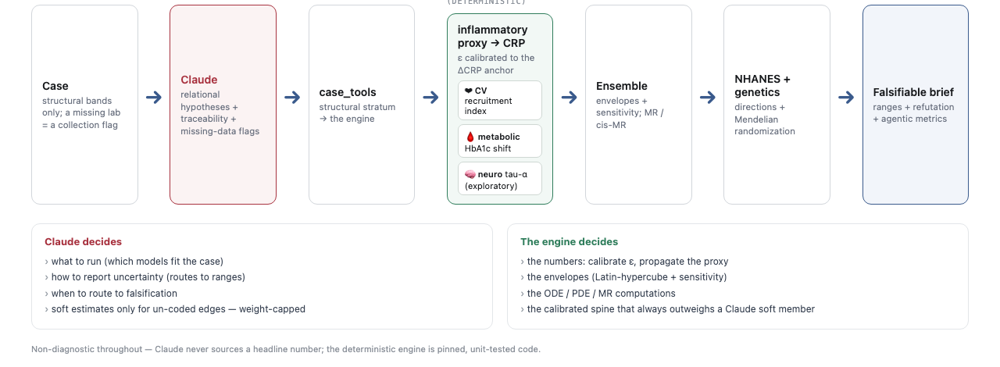

*Quién hace qué: **Claude** decide qué correr, cómo reportar la incertidumbre y cuándo enrutar a la
falsación; **el motor determinista** decide los números. Claude nunca inventa un número de titular.*

### La capacidad que lo hace "clic" — un copiloto de investigación clínica

Dos revisores clínicos expertos convergieron en un afinamiento: el investigador llega con una *pregunta*, no
con un paciente, y el cuello de botella es **armar una cohorte a partir de registros fragmentados** — semanas
de revisar historias. Por eso lo primero que muestra HISTORA es eso: filtra un corpus hasta la cohorte
elegible, **marca lo que falta**, y dice con claridad qué **no** pueden responder los datos — y después
exporta un protocolo preliminar.

> **"Los investigadores no necesitan otro chatbot. Necesitan una IA que construya cohortes listas para
> investigar a partir de datos clínicos fragmentados."** *IL-6/CRP es la hipótesis de hoy — mañana es otra.*

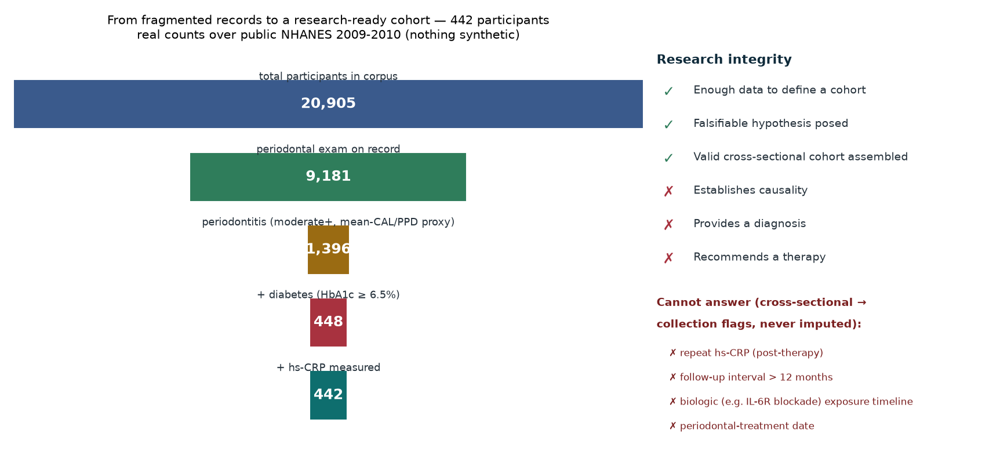

*Real, sobre el NHANES 2009-2010 público (`demo/run_cohort.py`, nada sintético): **20.905 → periodontitis →
+diabetes → +hs-CRP → una cohorte de 442.** El corpus es transversal, así que HISTORA dice qué **no** puede
hacer — sin PCR repetida, sin seguimiento, sin timeline de exposición a biológico — como banderas de
recolección, nunca imputadas. Ese "no puede responder" honesto, sobre datos reales, es el diferenciador. El
mecanismo (más abajo) y la genética entran **después**, como la plausibilidad biológica que hace que valga la
pena construir la cohorte.*

---

## Parte II — El problema

### 1. Los silos
La periodontitis, la aterosclerosis, la diabetes tipo 2 y el Alzheimer se estudian en compartimentos
separados: distintas especialidades, distintos datasets, distintos modelos. Sin embargo, la evidencia
sugiere un **conductor común río arriba** — la inflamación, y específicamente el eje **IL-6 → CRP**.

### 2. El eje inflamatorio compartido
Una fuente periodontal crónica eleva la **IL-6**; la IL-6 señaliza al hígado (vía el receptor
**IL-6Rα / gp130**) y el hígado secreta **CRP**. Desde esa "ganancia inflamatoria compartida" se bifurcan
tres ejes: **cardiovascular** (reclutamiento de monocitos, ateroma), **metabólico** (resistencia a la
insulina → HbA1c) y **neuro** (neuroinflamación → tau; **exploratorio**).

### 3. Tres dificultades que son también restricciones de diseño
1. **Fragmentación de datos.** Lo oral y lo sistémico viven separados y nunca co-presentes en una línea
   temporal; las relaciones cruzadas ni siquiera se pueden *representar*.
2. **Tamaños de efecto chicos y honestos.** La periodontitis es *un contribuyente entre muchos*.
   Cualquier herramienta que infle la señal para verse impresionante es científicamente deshonesta.
3. **La brecha de honestidad de la IA.** Un modelo de lenguaje, si se lo deja suelto sobre datos de salud,
   alucina un número sin cita, da un punto donde solo corresponde un rango, o deriva hacia un diagnóstico
   individual. Ese es el riesgo que la arquitectura de HISTORA existe para eliminar **por construcción**.

---

## Parte III — Las ideas

### Idea 1 — Un proxy compartido, tres ejes (una sola palanca)
En vez de tres modelos independientes, hay **un único parámetro calibrado**. Una intervención mueve los
tres ejes **de forma coherente** — no son tres conjeturas separadas, es *una palanca, tres enfermedades,
un motor.*

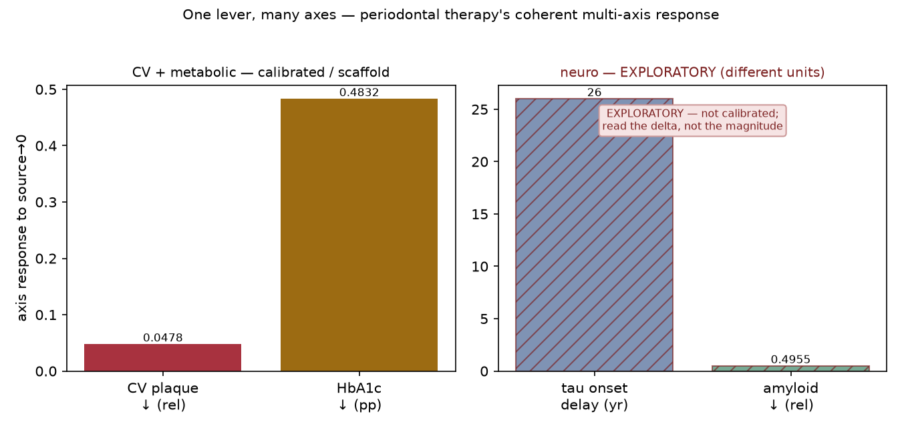

*El panel integrador. El eje neuro se dibuja **aparte y marcado EXPLORATORIO** para que sus números nunca
se citen como un resultado calibrado — la honestidad está en la figura, no solo en la leyenda.*

### Idea 2 — Calibrar a un ancla interventional (no a una correlación)
El único borde incierto del sistema (cuánto CRP produce una unidad de IL-6) se **fija (ε)** a un dato real
de intervención: el **descenso meta-analítico de hs-CRP tras la terapia periodontal (~0,5 mg/L)**. Así el
efecto predicho está *anclado a datos de tratamiento*, no *afirmado*.

### Idea 3 — Validar de forma independiente
- **NHANES** (datos públicos y anonimizados): las tres direcciones predichas son reales y **sobreviven a
  una estadística ajustada por diseño** (pesos de muestreo complejos + control de multiplicidad/FDR).
- **Randomización mendeliana** (GWAS públicos): **IL-6R → enfermedad coronaria es causal**; la **CRP
  circulante → coronaria es nula** (el marcador no es causal, el *nodo* sí); y **CRP/IL-6 → Alzheimer es
  nula**, que es por lo que el eje neuro queda **exploratorio**.

> **Calibración ≠ validación.** La calibración fija el borde incierto a un ancla *interventional*; la
> validación es independiente (los signos de NHANES y la sonda genética). Nunca presentamos una como la otra.

### Idea 4 — La honestidad como propiedad estructural (el *research-integrity gate*)
Cada salida se verifica contra un **invariante protegido**: sin diagnóstico ni afirmación individual; sin
imputar un valor de paciente (un dato faltante es una *bandera de recolección*, nunca un número inventado);
con trazabilidad y nivel poblacional/de-parámetro. Su cláusula más filosa es **no-diagnóstico**. Este gate
se aplica como chequeo binario duro y — clave — vive **fuera** de la parte que Claude puede auto-editar
(ver Idea 6).

### Idea 5 — El sistema agéntico autónomo (Claude en todas las capas)
El propio desarrollo es un artefacto del proyecto: un sistema agéntico autónomo bajo dirección humana.
- **Director (humano).** Un bioingeniero + ingeniero de IA fija los objetivos, valida, toma las decisiones
  y dirige (aprueba riesgos, elige anclas, veta alcance).
- **Constructor + auto-optimizador (Claude Code).** Un agente autónomo que **propone, reescribe sus propios
  skills, investiga, se auto-corrige y consulta** al director en las decisiones genuinamente abiertas.
- **Operador (Claude Code → plugin de Chrome → Claude Science).** El mismo agente **despliega y opera** el
  proyecto: maneja el plugin de Claude-para-Chrome para correr HISTORA dentro de Claude Science.
- **Usuario-científico (Claude, dentro de Claude Science).** Claude actúa como **usuario calificado** que
  evalúa el trabajo, renderiza las figuras y estructuras 3-D y —vía el **agente revisor**— audita las
  salidas, *encuentra fallas reales* y motiva correcciones.

### Idea 6 — La auto-evolución de skills (SkillOpt), con seguridad por construcción
HISTORA puede **mejorar sus propios skills de razonamiento**, de forma segura. Un bucle evolutivo con
compuerta: Claude propone una edición a un `SKILL.md` entrenable; se **adopta solo si** mejora medible y
estructuralmente (intervalo de confianza que excluye el 0) **y** el gate no-diagnóstico sigue pasando en
**todos** los casos. El *genoma* es únicamente la prosa de los skills entrenables; el guardrail, el registro
de citas y el motor están **fuera** de él — la evolución literalmente no puede tocarlos.

---

## Parte IV — Las soluciones (el detalle técnico)

### El motor mecanístico (profundidad Stage-3)
Cada eje es un modelo real, testeado y no-diagnóstico — **no** un multiplicador lineal:

| Eje | Modelo | Qué muestra |
|---|---|---|
| Núcleo inflamatorio | ODE reducida TNF/IL-6/IL-10 (Reynolds/Kumar) | **dos cuencas** — agudo/resolutivo vs crónico (biestabilidad que un escalar no expresa) |
| Cardiovascular | ODE de célula espumosa (Ougrinovskaia) | la placa como un **proceso**, no un índice |
| Metabólico | modelo mínimo glucosa-insulina (Bergman) | S_I degradada por inflamación → HbA1c, calibrado al ancla de ~0,35 pp |
| Diabetes↔perio | bucle de realimentación cerrado | un **punto fijo** — la hiperglucemia amplifica la fuente |
| Neuro *(exploratorio)* | amiloide (Hao–Friedman) + frente de tau (Braak) | la cascada A/T, **marcada**, con APOE4/edad como modificadores |

  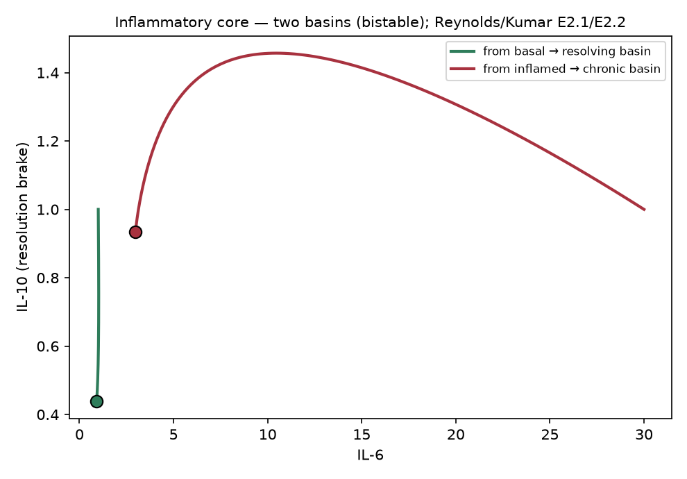
  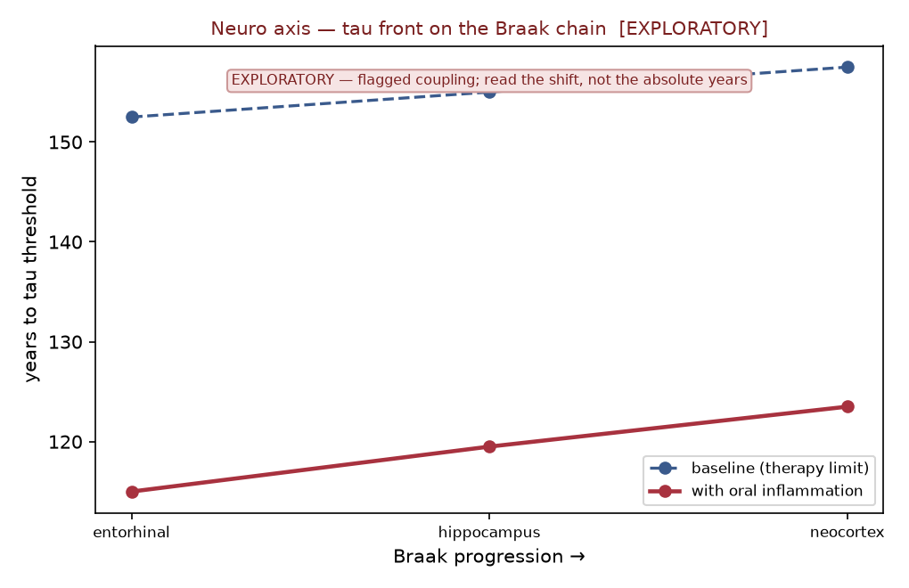

  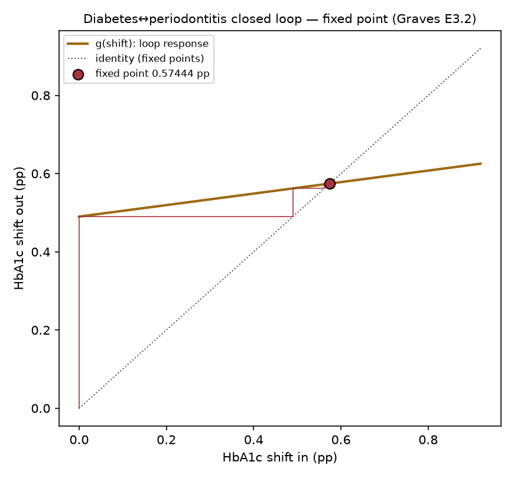
  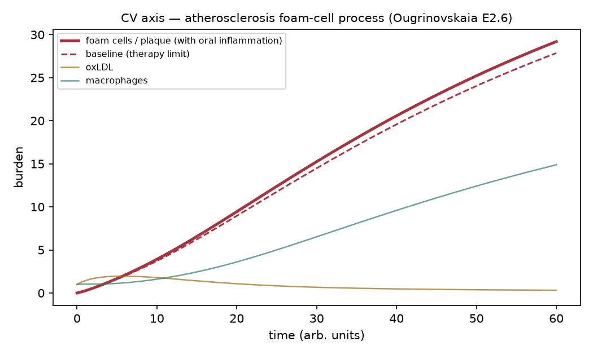

*De izq. a der.: las dos cuencas inflamatorias; el frente de tau avanzando por la cadena de Braak (marcado
EXPLORATORIO — se lee el *desplazamiento*, no los años absolutos); el bucle diabetes↔perio convergiendo a
un punto fijo; el proceso de placa.*

### La capa de proteínas — anclar el mecanismo en moléculas
El proxy compartido se ancla en identidad molecular real: **IL-6 → IL-6Rα / gp130 → CRP**, con el
**tocilizumab** marcando el nodo causal. Cada mediador lleva su **número de acceso de UniProt** — la clave
estable que el conector UniProt/PDB de Claude Science resuelve en estructuras 3-D reales.

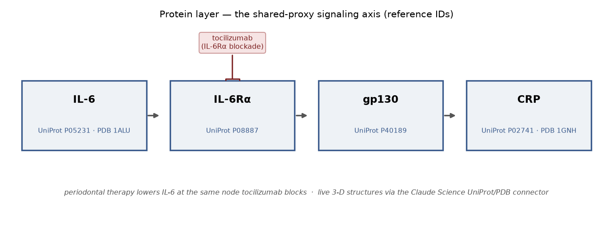

  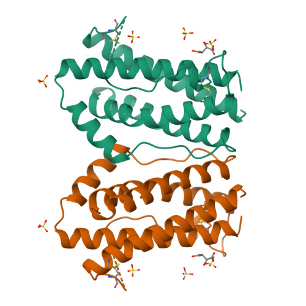
  
  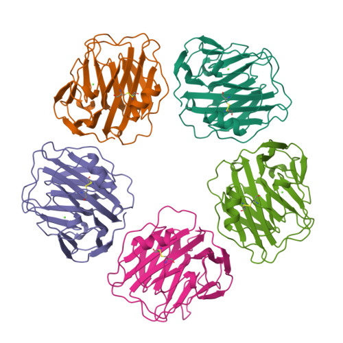

*Las estructuras reales del nodo: IL-6 (`1ALU`) → el hexámero de señalización (`1P9M`) → CRP (`1GNH`).
Claude Science las renderiza **interactivamente** vía el conector. Imágenes: RCSB PDB (rcsb.org).*

### El gate no-diagnóstico y la entrega
El invariante de integridad de investigación se aplica en cada salida. La herramienta se entrega en **dos
superficies, un motor**: un **plugin portátil de Claude Code** (el demo que un jurado corre en cualquier
lado) y su hogar de laboratorio, **Claude Science**, donde los mismos `skills/` son skills, el arnés
`histora` es una *pipeline* reutilizable, los `agents/` son agentes especialistas y UniProt/PDB/OpenGWAS/
NHANES son los conectores.

### La auto-evolución (SkillOpt) — lo que corrimos, honestamente
En vivo, con Claude como operador de mutación y un agente de Claude como razonador puntuado, sobre tres
skills reales:

| Skill | Métrica | Resultado | Patrón |
|---|---|---|---|
| `traceability-audit` | cobertura de citación de campos | **adoptado** 0,00 → 0,93 | knowledge_gap |
| `cardiometabolic-framing` | cobertura de etiquetado de vía | **adoptado** 0,00 → 0,67 | **execution_gap** |
| `record-normalization` | recall de banderas MISSING | **nulo** — el padre ya óptimo | — |

Dos skills mejoraron *por mecanismos distintos*; a un tercero se lo **dejó correctamente intacto** porque ya
estaba en su techo. Que el bucle **no fabrique una ganancia donde no la hay** es la propiedad
anti-reward-hacking que hace creíbles las ganancias adoptadas.

---

## Parte V — Los resultados

Corrimos el **caso flagship** de punta a punta **dentro de Claude Science**, sobre el motor de `main`
actual, con los conectores reales. Es *"guionado como un demo, real como un experimento"* — el camino es
real; **nada está falseado.** Las capturas siguientes son la sesión real.

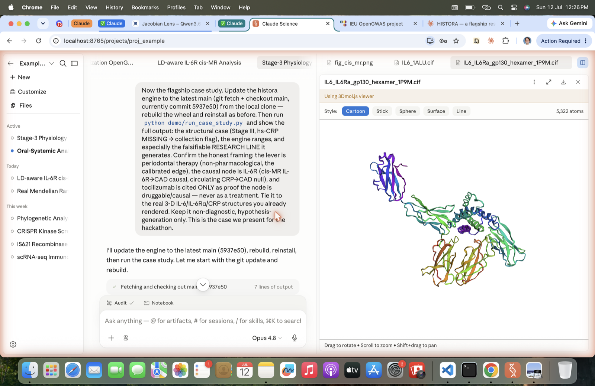

*El flujo de trabajo: entra una directiva y Claude — como operador — actualiza el motor pineado y corre la pipeline.*

### El caso y la línea de investigación (salida real del motor)
Un estrato estructural — **Periodontitis Estadio III · sangrado alto · diabetes tipo 2 · hs-CRP AUSENTE →
bandera de recolección**. El motor bifurca el proxy compartido a tres ejes como **rangos al 90%**:

| Salida | Mediana | Banda 90% |
|---|---|---|
| CRP (mg/L) | 3,18 | [2,89; 3,45] |
| Cambio de HbA1c (pp) | +0,49 | [0,27; 0,71] |
| tau-α (incr. rel.) | +0,21 | [0,11; 0,40] · **EXPLORATORIO** |

**La línea de investigación falsable que genera** (con el ancla segura):
- **Palanca = terapia periodontal** (no farmacológica, el borde exacto sobre el que el motor está
  *calibrado*) — ΔhsCRP predicho **0,68 mg/L**.
- **Nodo causal = IL-6R.** MR-cis: **IL-6R → coronaria causal** (β ≈ +0,705 ajustada por LD); **CRP
  circulante → coronaria nula**. El **tocilizumab** (bloqueo de IL-6Rα) se cita **solo** como prueba de que
  el nodo es causal/drogable — **nunca como tratamiento.**
- **Hipótesis:** si el nodo IL-6R media el efecto sistémico, bajar la fuente periodontal de IL-6 debería
  mover los marcadores en la dirección que la genética implica — *una línea de investigación testeable, no
  una terapia.*
- **Trae su propia refutación** (si la terapia no baja la hs-CRP → calibración errada; si un análisis
  instrumentado por IL-6R no muestra efecto coronario → cae la premisa del nodo; si el marcador se mueve
  en dirección opuesta → refutada la mediación) y **nombra su supuesto más frágil** (la transferencia
  población→estrato, no testeada).

Claude Science **verificó cada línea roja de honestidad de forma programática** contra `case_study.json` ✓.

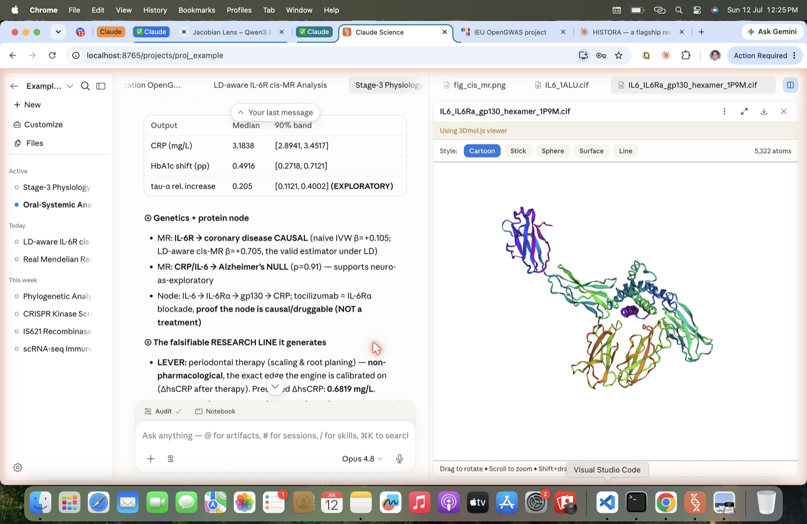

*La ciencia, en vivo en Claude Science: los rangos al 90% del motor, el nodo de la MR y la línea de
investigación falsable, junto al hexámero IL-6/IL-6Rα/gp130 (1P9M) en el visor Mol\* interactivo.*

### El "beat" del usuario-científico — el revisor encontró un error real, y Claude se auto-corrigió
El **agente revisor** de Claude Science auditó la corrida y devolvió **un hallazgo**: la prosa de cierre
decía que la resolución del hexámero era *"2,4 Å"*, pero el `1P9M` es **3,65 Å** (los 2,4 Å corresponden a
`1N26`, otra estructura, de dominio único, no el hexámero). El manifiesto guardado ya registraba los 3,65 Å
correctos — solo se equivocó la prosa. **Claude leyó el hallazgo y se corrigió** de inmediato; nada aguas
abajo se vio afectado.

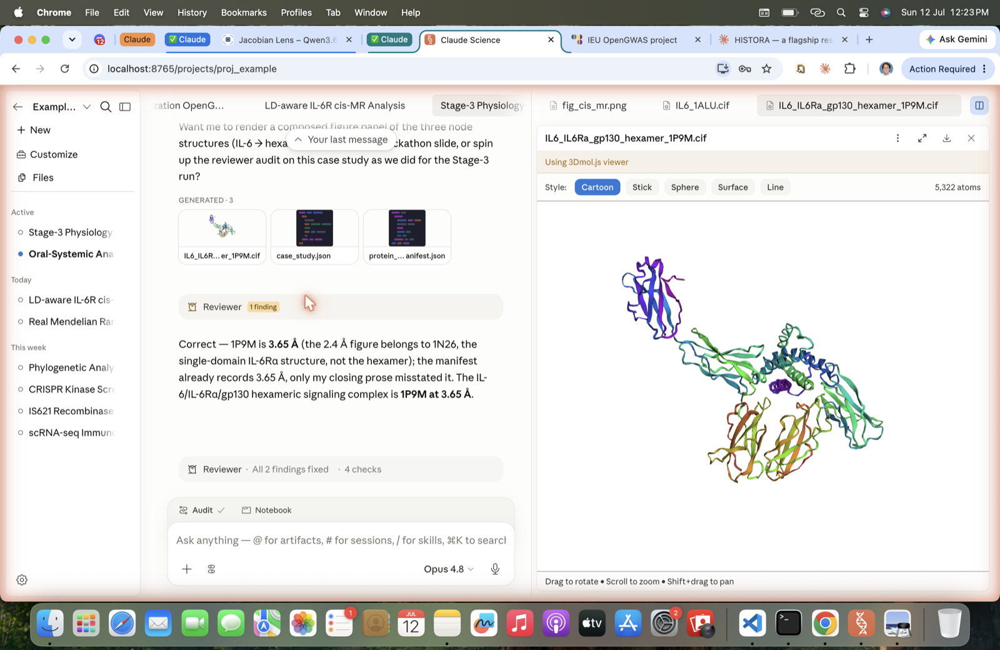

*El bucle de honestidad funcionando a la vista: un revisor calificado detecta un desliz real, el agente lo
corrige, y el registro queda exacto — **mostrado, no dramatizado.***

---

## Parte VI — Qué dejamos afuera (y el futuro)

Todo lo siguiente quedó **deliberadamente fuera del alcance del hackathon**, pero es una extensión natural y
honesta:

- **SkillOpt multi-generación + ensemble, seguros.** Extender el bucle más allá de una generación *sin*
  perder la disciplina anti-reward-hacking (métricas por-skill externas + una métrica de ensemble que siga
  siendo estructural/held-out, nunca juzgada por el modelo).
- **Más ejes y mecanismos.** La biblioteca de modelos tiene modelos citados-pero-no-construidos (renal,
  hepático, dinámica adicional de microbioma/keystone) listos para promover a código testeado bajo la misma
  disciplina de niveles.
- **Conectores a escala de laboratorio.** Correr el arnés y los conectores UniProt/PDB/OpenGWAS/NHANES a
  escala en Claude Science (encaje natural con el programa AI-for-Science de Anthropic), con figuras nativas
  animadas.
- **Líneas de investigación secundarias (honestas, no protagonistas).** Intervenciones conductuales /
  profilácticas que alteren la fisiología oral; la línea microbioma *P. gingivalis* / gingipaínas → tau
  (dejada fuera del titular porque agrega ciencia nueva y vive en el eje neuro exploratorio) — como
  hipótesis falsables adicionales, nunca afirmaciones de eficacia.
- **Diseño de validación prospectiva.** El propósito de la herramienta es *plantear* un estudio; un paso
  natural es especificar el diseño (cohorte, endpoints, criterios de refutación) que testearía la hipótesis
  de mediación por IL-6R que genera — pasando de *dirección* soportada por MR hacia evidencia interventional.
- **Diagnóstico de trazas de comportamiento.** Analizar las propias trazas de razonamiento del agente
  (corto y largo plazo) para hallar y corregir defectos sistemáticos — una vía de calidad interna que
  delimitamos pero no construimos.

---

*No-diagnóstico en todo · nivel poblacional / de-parámetro / molecular / de-instrumento solamente ·
MR ≠ ECA · calibración ≠ validación · generación de hipótesis, nunca eficacia, prevención ni diagnóstico.
No es consejo médico — es un instrumento de investigación.*
