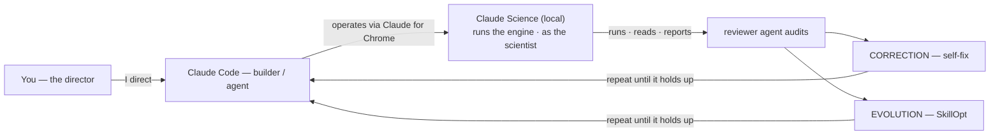

# How it was built — the supervised autonomous loop

> The builder-track question is *"can this agent actually build the tool a user is missing?"* HISTORA's
> answer is the process itself: **Claude Code, under human direction, built the software *and* operated
> the science** — driving Claude Science through the Claude for Chrome extension, in the role a researcher
> would occupy, inside a loop that evolves and corrects itself.

## The loop

```
        You ──I direct──▶ Claude Code ──operates via Claude for Chrome──▶ Claude Science (local)
      (director)          (builder · agent)                              runs the engine · as the scientist
          ▲                     ▲                                                   │
          │                     │                                        runs · reads · reports
          │                     └──────────── repeat until it holds up ──────┐      ▼
          └──────────── open decisions, credentials, go-live ───────────  reviewer agent audits
                                                                           ├─ CORRECTION  (self-fix)
                                                                           └─ EVOLUTION   (SkillOpt)
```



## What each role actually does

- **You — the director.** Set the goal, approve genuinely open decisions, and keep the actions a human
  must keep: entering any credential/token, clicking network-access and go-live gates, and the strategic
  calls. Supervision is real, not cosmetic.
- **Claude Code — the builder/agent.** Under that direction, it wrote the engine, the tests, and the
  guardrail (`src/histora/`, `tests/`, the Claude Code plugin + skills), *and* it operated the research
  platform. It is the same agent on both sides of the line: it authors the software and then runs it.
- **Claude Science — the runtime, operated as the scientist.** Claude Code drives a locally-running Claude
  Science through the **Claude for Chrome** browser-automation extension — importing HISTORA's skills,
  connecting public data connectors (OpenGWAS, UniProt/PDB, human-genetics), running the mechanistic
  engine, rendering structures in the Mol\* viewer, and reading the results back. It occupies the operator
  role a researcher/clinician/bioengineer would — issuing the research directives, not waiting to be asked.
- **The reviewer agent — the audit.** Claude Science's reviewer agent independently audits every claim and
  artifact; its findings feed the two mechanisms below.

## The two mechanisms that make the loop close

- **Correction.** When the audit (or the agent's own re-checking) surfaces an error, it is retracted and
  fixed with a regression test — including, memorably, a bug in HISTORA's own flagship number
  (+0.705 → +0.553). See [`SELF-CORRECTION.md`](SELF-CORRECTION.md).
- **Evolution.** A gated evolutionary loop (**SkillOpt**) improves the agent's own skills, but adopts an
  edit *only* if a machine-checkable metric improves (bootstrap CI excludes 0) **and** the guardrail stays
  1.0 — and it leaves an already-optimal skill untouched (a deliberate null result, anti-reward-hacking).
  See [`EVOLUTION.md`](EVOLUTION.md).

Together they are why the loop is *autonomous but not unaccountable*: it runs many steps without
hand-holding, yet every headline number is either audited-and-survives or retracted-and-fixed.

## Why this matters for the builder track

"Build Beyond the Bench" asks for **working software a named user could run without you in the room, built
to outlast the week.** HISTORA clears that bar — `git clone` → `python demo/run_cohort.py`, deterministic
and offline, with passing tests and an Apache-2.0 license. But the *process* is the stronger proof: an
agent that can operate a real research platform in the scientist's role, catch its own mistakes, and
improve its own skills is an agent you can trust to maintain the tool after the demo ends.

*The real session is captured in [`assets/claude-science/`](assets/claude-science/) (01–07); the live-run
comparison is in [`internal/CLAUDE-SCIENCE-ANALYSIS.md`](internal/CLAUDE-SCIENCE-ANALYSIS.md). Non-diagnostic
throughout.*
