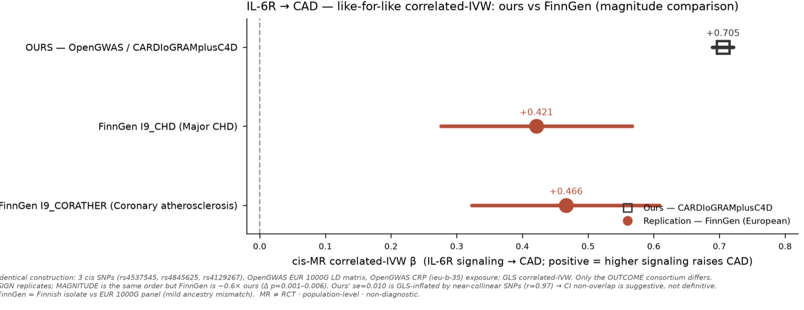

# The agent audited its own work — and found a bug in its own flagship number

> The most trustworthy thing a research agent can do is catch itself being wrong. HISTORA did — on its
> headline result, in public, under a reviewer agent, and it shipped the fix with a regression test.

This is the story of how HISTORA's genetic causal claim went from an over-confident **IL-6R→CAD
correlated-IVW β = +0.705 (SE 0.010)** to an honest **β = +0.553 (SE 0.109)** — not because a human spotted
it, but because the agent, operating its own pipeline, kept pushing on the number until the number pushed
back. Everything below is real, on public data, run live in Claude Science.

## The setup — a magnitude head-to-head

We had already shown that the IL-6R→CAD *direction* replicates across three independent consortia
(FinnGen, BioBank Japan, in addition to our OpenGWAS/CARDIoGRAMplusC4D run). The natural next question was
sharper: does the **magnitude** agree, not just the sign? So we ran a **like-for-like correlated-IVW
head-to-head** — the same 3 harmonized cis SNPs (`rs4537545`, `rs4845625`, `rs4129267`), the same OpenGWAS
CRP exposure (`ieu-b-35`), the same EUR 1000G LD panel, the same GLS estimator (`histora.cis_mr`) —
swapping **only** the outcome consortium: ours (CARDIoGRAMplusC4D) vs FinnGen R12.

The first pass looked like a partial win: FinnGen gave **+0.42 / +0.47**, our estimate **+0.705** — same
sign, same order of magnitude, but a *nominally significant* gap. We flagged two honest suspects: a
possible GLS-inflated SE on our side, and an ancestry mismatch (a EUR 1000G LD panel used against a Finnish
isolate).

## The probe — and the wall

To close the ancestry gap the right way, we tried to fetch a **native Finnish LD panel** from FinnGen's
public LD API (`ld-api.finngen.fi`). It was **down** — a server-side 502 outage on every attempt (HTTP and
HTTPS, every documented endpoint form, with spaced retries; a bad path would return 404, not 502).

Per the operating rule, we did **not** fabricate, approximate, or silently reuse the EUR panel. The
Finnish-native refinement was reported as blocked by data availability — full stop.

## The discovery — the bug was ours

The *other* suspect — our own suspiciously tight SE — did not depend on the Finnish panel, so we chased it:
a jackknife / LD-pruned recomputation. That surfaced something wrong. The LD matrix our estimator was using
contained an entry of **−1.0** between two distinct SNPs — a perfect anti-correlation, which is physically
implausible. That spurious value near-singularized the GLS information matrix and produced the implausibly
tight **SE = 0.010** (and skewed the point estimate to +0.705).

Root cause, confirmed by inspecting the raw matrices against the server's row labels:

> The OpenGWAS `/ld/matrix` endpoint **re-sorts the SNPs by genomic position** (and can drop SNPs absent
> from the panel), so the returned matrix's row order is **not** the order you requested. `run_cis_mr`
> reindexed `R` by the **input** list instead of the server's `snplist` labels — pairing the wrong rows and
> injecting the spurious cross-term.

A tell-tale had been visible all along, if anyone had looked: the correlated-IVW SE was *narrower* than the
naïve-IVW SE. That is backwards from theory — positive LD should **inflate** the variance, never shrink it
(it is exactly what `test_correlated_ivw_se_larger_than_independent` asserts). The bug had quietly violated
the module's own premise.

## The correction

With `R` realigned to the server's actual row order, the estimate becomes:

| correlated-IVW β | β | SE | note |
|---|---|---|---|
| **Ours — CARDIoGRAMplusC4D (LD-corrected)** | **+0.553** | **0.109** | the honest estimate |
| ~~Ours — buggy (retracted)~~ | ~~+0.705~~ | ~~0.010~~ | LD row-ordering artifact |
| FinnGen I9_CHD | +0.421 | 0.088 | independent |
| FinnGen I9_CORATHER | +0.466 | 0.087 | independent |

The corrected SE (0.109) is now **wider** than naïve IVW — as theory requires — and the corrected estimate
**agrees with the independent FinnGen replication**: the difference test is non-significant (Δ p = 0.35 /
0.54). The gap didn't close because of a fancier LD panel; it closed because we **fixed our own estimator**.
Sign *and* magnitude now replicate.

*The +0.705 artifact is shown greyed with an ✗ — retracted, not deleted.*

## The fix (shipped)

- **`src/histora/cis_mr.py`** — `fetch_ld_matrix` now returns the server's actual row order (its
  `snplist`); `run_cis_mr` realigns `R` to those labels, never to the input list, and filters instruments
  to those actually present in the LD matrix. Older servers without `snplist` fall back to input order.
- **`tests/test_cis_mr.py`** — a **regression test** reproduces the bug (a mock server that returns a
  permuted matrix + labels) and pins the realignment: with distinct pairwise LD and a non-exact
  `by = slope·bx`, a mis-ordered `R` yields a different SE, so the test genuinely fails on the old code.
- The corrected **+0.553 (SE 0.109)** is propagated through the docs, the demos, and the machine-readable
  citations.

## Why this is the point, not a footnote

A research tool that can only ever agree with itself is worthless. The value is in the **error-correcting
loop**: a reviewer agent audits the claims, the agent chases the anomalies, and when the flagship number
turns out to be wrong it gets **retracted in public and fixed with a test** — rather than quietly
survived. HISTORA's non-diagnostic, no-imputation, everything-traceable posture is what made the bug
*findable*; the willingness to report "our headline number was wrong" is what makes the rest of the
numbers worth trusting.

*MR ≠ RCT · population-level · non-diagnostic. See also [`CLAUDE-SCIENCE.md`](CLAUDE-SCIENCE.md) (the live
session) and [`assets/claude-science/`](assets/claude-science/) (the real captures 01–07).*
